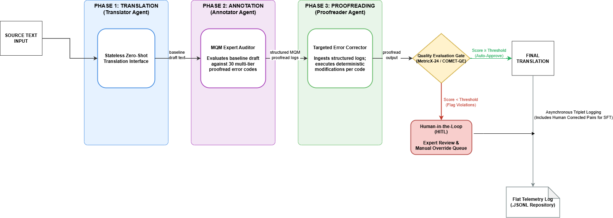

# Multi-Agent Translation & Evaluation Pipeline (TAP-MAS)

This directory contains the architecture blueprint and core configuration layout for a decoupled, three-phase **Translator-Annotator-Proofreader Multi-Agent System (TAP-MAS)**. Modeled after contemporary multi-agent translation frameworks, this platform isolates raw translation, translation quality auditing, and targeted error correction into autonomous linguistic nodes.

---

## System Architecture Overview

The system rejects the traditional approach of using a single, monolithic LLM prompt for end-to-end document translation. Instead, it breaks the pipeline down into an optimized, three-stage sequential workflow unified by a conditional, quality-managed **Human-in-the-Loop (HITL)** governance gate:

### Phase & Gateway Breakdown

1. **Phase 1: Translator Agent (Stateless Zero-Shot Interface):** Ingests the raw source text chunk and converts it into a baseline target language draft using a high speed,low-cost LLM.
2. **Phase 2: Annotator Agent (MQM Expert Auditor):** Functions as an evaluator. Audits the baseline draft against **30 standardized subcategories of translation errors** spanning the categories - Accuracy, Fluency, and Style/Usage, generating structured, machine-readable validation logs identifying the exact segment violations.
3. **Phase 3: Proofreader Agent (Targeted Error Corrector):** Acts as a deterministic editor. Rather than guessing or rewriting paragraphs broadly, it consumes the raw source, the baseline draft, and the explicit error logs from Phase 2. It refines the translation exclusively where flags were raised, outputting the final gold-standard text.
4. **Programmatic Quality Evaluation Gate:** Ingests the raw source text and Phase 3's final output to perform reference-free quality estimation via advanced neural evaluation metrics (**MetricX-24 / COMET-QE**). 
   * **Automated Branch:** Segments hitting or exceeding the configured quality score threshold are cleared instantly as a *Final Translation*.
   * **Human-in-the-Loop (HITL) Branch:** Segments that fall below the threshold are flagged as exceptions and routed into a dedicated human editing interface, ensuring expert verification for complex text blocks.

---

## Self-Improving Flywheel: Asynchronous Long-Term Evolution

To overcome localized terminology drift and continuously improve the system without adding real-time application database dependencies, the platform treats both the automated multi-agent outputs and the human manual overrides as structural assets for an **Asynchronous Telemetry Fine-Tuning Cycle**.

1. **Unified Telemetry Collection:** Whether a segment is cleared automatically by the Quality Gate or edited by a senior translator in the HITL queue, the final verified triplet `(Source Text, Phase 1 Draft, MQM Feedback, Gold-Standard Target)` is asynchronously logged into an append-only `.jsonl` telemetry repository.
2. **Premium Data Valuation:** Corrected segments originating from the HITL queue are flagged with a high-priority data weight, as they contain specific real-world examples of where the core multi-agent system encountered structural failure.
3. **Asynchronous Knowledge Distillation:** Periodically, this telemetry bucket serves as a supervised fine-tuning (SFT) dataset to retrain the Phase 1 model. By baking human corrections directly into the base model's neural weights, the initial translation layer naturally stops generating those specific errors out of the box—systematically forcing down future downstream error density and minimizing human intervention requirements over time.
---

## Core Design Thinking & Rationale

### 1. Isolation of Cognitive Complexity
By decoupling translation from quality control, each model configuration is restricted to a narrow cognitive objective. Phase 1 focuses purely on linguistic mapping; Phase 2 acts strictly as an objective critic; Phase 3 operates solely as a targeted surgical editor. This constraint yields vastly superior structural adherence compared to unguided, single-prompt translations.

### 2. Hallucination Control via Directed Editing
A common failure mode of LLM proofreading is "creative drift," where an editor model introduces entirely new stylistic choices or semantic hallucinations while fixing a minor error. This framework forces Phase 3 to act *only* on the explicit coordinates supplied by Phase 2's MQM codes, binding the final generation strictly to verified error mitigation.

### 3. Compute Asymmetry & Cost-Tiering
Not all translation tasks demand high-tier reasoning capabilities. This architecture intentionally matches model costs to phase complexity:
* **The "Worker" Layer (Phase 1):** Uses high-speed, low-cost LLMs (e.g., *Gemini Flash*) to generate baseline drafts.
* **The "Cognitive" Layers (Phases 2 & 3):** Reserves expensive premium frontier reasoning models (e.g., *Gemini Pro* ) exclusively for auditing structured metrics and synthesizing corrections.

### 4. Dynamic Risk Mitigation & Human-in-the-Loop Governance
In high-stakes enterprise environments, relying blindly on autonomous LLM outputs introduces critical liability and compliance risks. Conversely, forcing human experts to review 100% of pipeline output eliminates the cost and throughput advantages of generative AI. 

---

