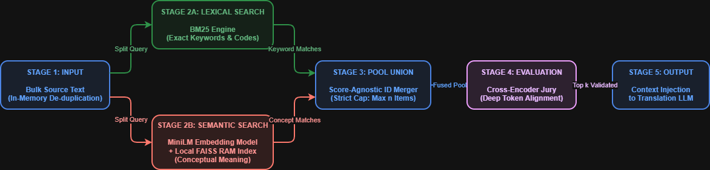

# Tier 2: Hybrid Lexical-Semantic Architecture

## Architectural Overview
The **Hybrid Lexical-Semantic** module handles local high-accuracy terminology retrieval. This engine executes a dual-stream cascading search strategy. It combines traditional lexical (keyword) matching with semantic (vector) search, fuses the candidate pools, and uses a precise local Cross-Encoder to rank and select the optimal translation glossary context.

---

## Pipeline Execution Flow

### Stage 1: Bulk Source Text Input & De-Duplication
The system ingestion layer is built for array-based bulk translation processing. Before executing network or vector operations, incoming arrays are de-duplicated using an in-memory, order-preserving mapping strategy. This cuts redundant downstream processing overhead and eliminates payload inflation.
### Stage 2: Parallel Dual-Stream Retrieval
To close vocabulary gaps and handle precise alphanumeric matches simultaneously, the query runs through two independent tracks:
* **Stage 2A (Lexical Anchor Stream):** A local **BM25 Engine** scans for exact token matches, capturing product codes, specific acronyms, and strict brand names.
* **Stage 2B (Semantic Core Stream):** The raw text is passed to a local `paraphrase-multilingual-MiniLM` embedding model, generating a 384-dimension vector. This vector is evaluated against an in-memory **FAISS RAM Index** using Cosine Similarity to capture conceptual meanings, even when the exact phrasing differs.

### Stage 3: Candidate Pool Union
* **Purpose:** Merges the results of two fundamentally different scoring metrics (lexical scores vs. semantic cosine similarity) without distorting the data.
* **Mechanism:** The layer performs a score-agnostic logical `UNION` on the entity IDs returned by both tracks. It eliminates any overlapping duplicates and applies a strict **maximum cap of n candidate items** to protect downstream attention layers from latency spikes.

### Stage 4: Cross-Encoder Evaluator Jury
* **Purpose:** Eliminates false positives from the initial retrieval streams.
* **Mechanism:** The n fused candidates are passed directly to a local CPU-bound Cross-Encoder (`mmarco-mMiniLM`). Unlike bi-encoders that process text separately, the Cross-Encoder performs deep token-to-token cross-attention over the query and the candidate simultaneously, generating a definitive, highly accurate relevancy ranking.

### Stage 5: Context Injection & Exit Gate
* **Top-K Validated Match:** Rather than restricting the pipeline to a hardcoded singular result, the engine evaluates and passes a parameterized array of top-scoring matches (`Top-K Validated`). This optimized context is injected directly into the core translation LLM prompt as a strict translation constraint.
* **Fallback Logic:** If no candidate passes the minimum confidence threshold, the pipeline safely relies on the **LLM Base Capability Fallback**, allowing the standard translation engine to handle the text normally.

---

## Configuration & Parameter Management
The underlying mathematical parameters for this entire pipeline are managed dynamically through the module's configuration file:

📁 **[`tier2_config.json`](tier2_config.json)**

### Key Parameters Driven by the Configuration:
* **Pool Caps (`max_candidate_pool_limit`):** Sets the execution pool volume to a strict max of `15` items in Stage 3 and Stage 4 to preserve CPU memory efficiency.
* **Evaluation Window (`top_k_validated_output_limit`):** Configures the `Top-K` output size (set to `3`) handed off to the translation LLM in Stage 5.
* **Lexical Coefficients (`k1` & `b`):** Dictates the term-saturation (`1.2`) and length-normalization (`0.75`) weights for the Stage 2A BM25 engine.
* **Model References:** Declares the precise local asset paths for the `mMiniLM` Cross-Encoder.
