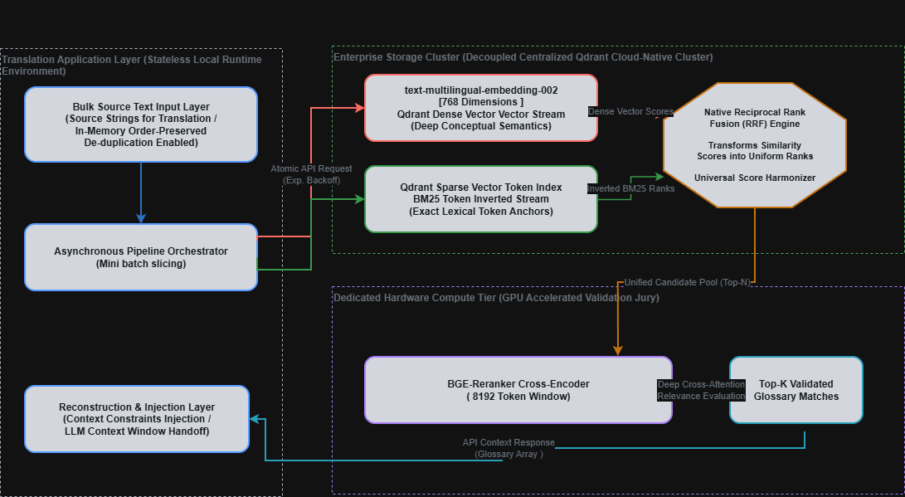

# Tier 3: Decentralized Large-Scale Hybrid RAG Architecture

## Architectural Overview
The **Decentralized Large-Scale Hybrid RAG** engine represents the highest tier of customer's maturity journey. This is engineered for advanced enterprise clients processing large cross-lingual data volumes. It executes a multi-stage, retrieval pipeline by pairing an independent cloud-native **Qdrant Storage Cluster** (combining dense vector semantics and sparse token inverted streams) with a **Dedicated GPU-Accelerated Validation Tier** to deliver high-accuracy glossary contexts with low latency boundaries.

---

## Pipeline Execution Flow
### Stage 1: Translation Application Layer & Stateless Runtime
The system ingestion layer is built for array-based bulk translation processing. Before executing network or vector operations, incoming arrays are de-duplicated using an in-memory, order-preserving mapping strategy. This cuts redundant downstream processing overhead and eliminates payload inflation.
* **Asynchronous Pipeline Orchestrator (Mini-Batch Slicing & Chunking):** The orchestrator divides massive input texts into optimized, manageable data slices. The sliced arrays are packed into single-hop atomic network requests protected by a `Exponential Backoff` retry mechanism to guarantee message delivery over remote endpoints.

### Stage 2: Enterprise Storage Cluster (Parallel Dual-Stream Retrieval)
This delegates vector lookups to a decoupled, distributed Qdrant database running parallel indexes:
* **Stage 2A (Dense Vector Stream):** Conceptual semantics are analyzed via an embedding model across 768 dimensions.
* **Stage 2B (Sparse Vector Token Index):** Simultaneously, an inverted lexical token index modifier natively enforces **BM25 ranking logic** to catch exact alphanumeric codes, brand acronyms, and strict glossary keyword anchors.
* **Early-Exit Payload Constraints:** Both streams apply an early-exit keyword payload filter ensuring Qdrant bypasses records lacking the requested target translation language, protecting cluster resources.

### Stage 3: Native Reciprocal Rank Fusion (RRF) Engine
* **Purpose:** Harmonizes raw, structurally incompatible similarity metrics (dense cosine alignment distance vs. sparse BM25 lexical scores).
* **Mechanism:** Executed natively inside the Qdrant cluster environment, the RRF engine transforms raw proximity metrics into uniform fractional ranks. It computes a unified, score-agnostic candidate pool ($Top-N$) to bridge the two storage streams without data distortion.

### Stage 4: Dedicated Hardware Compute Tier (GPU Validation Jury)
* **Purpose:** Eliminates false-positive candidate context .
* **Mechanism:** The unified $Top-N$ candidates are passed to a **BGE-Reranker-v2-m3 Cross-Encoder** model.  This executes deep token-to-token cross-attention over the query and the candidate simultaneously, generating a definitive, highly accurate relevancy ranking.

### Stage 5: Reconstruction, Filtering & Context Injection
* **Top-K Validated Filter:** The re-ranked matches are skimmed to keep only highly validated glossary pairs.
* **Reconstruction & Injection Layer:** The stateless FastAPI runtime maps the validated glossary arrays back into their original sequence positions using preserved global index mapping dictionaries.
* **LLM Context Window Handoff:** The sorted glossary constraints are injected directly into the LLM prompt context window for translation.

---

