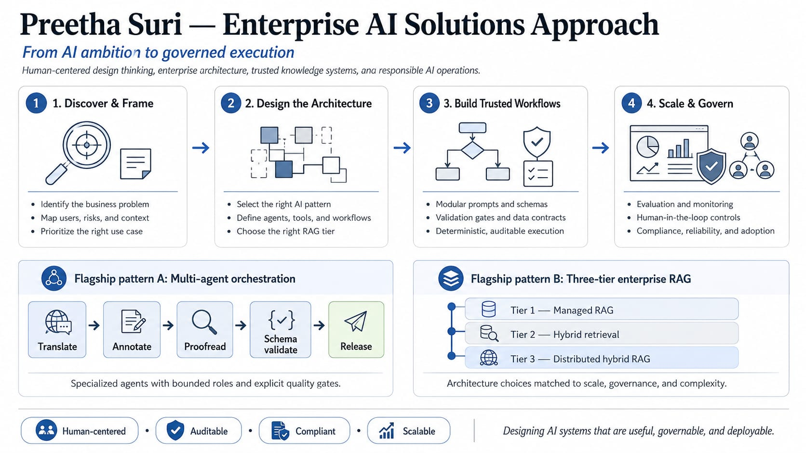

# Enterprise-GenAI-AgenticAI-DesignThinking



## Executive Summary
This repository serves as a  **AI Portfolio Garden**, showcasing architectural patterns for Generative AI and Agentic systems. Built through the lens of **Design Thinking**, the solutions prioritize human-centric problem solving, strict data governance and deterministic execution.

AI systems cannot afford to be "black boxes." This portfolio demonstrates how to build audited, compliant, and highly reliable AI systems capable of operating within strict institutional guardrails.

---

## Repository Architecture
This repository is engineered as a scalable monorepo. It isolates core business logic, data contracts, and algorithmic instructions to ensure high maintainability.

```text
Enterprise-GenAI-AgenticAI-DesignThinking/
│
├── README.md                          <-- (You are here) Executive Blueprint & Strategy
│
└── 01-AgenticAI-blueprints/           <-- Core Execution Module (Production Ready)
    ├── README.md                      <-- Technical Implementation Deep-Dive
    ├── 01-multi-agent-orchestration.png <-- Visual State-Machine System Architecture
    │
    ├── prompts/                       <-- Isolated Declarative Instruction Assets
    │   ├── phase1_translator_prompt.txt
    │   ├── phase2_annotator_prompt.txt
    │   └── phase3_proofreader_prompt.txt
    │
    └── schema/                        <-- Enterprise Data Contracts & Compliance Gates
        └── translation_pipeline_schema.json
└── 02-3tier-RAGArchitecture/          
    ├── README.md                      
    ├── tier1-vertexai-managed-engine/                       
    │   ├── architecture/
    │   │   ├── tier1_architecture.drawio
    │   │   ├── tier1_architecture.png
    │   │   ├── vertexai-rag-index-config.json
    │   └── README.md
    └── tier2-hybrid-lexical-semantic-engine/                       
    │   ├── architecture/
    │   │   ├── tier2_architecture.drawio
    │   │   ├── tier2_architecture.png
    │   │   ├── tier2-config.json
    │   └── README.md
    └── tier3-decentralized_large_scale_hybrid_rag/
    │   ├── architecture/
    │   │   ├── tier3_architecture.drawio
    │   │   ├── tier3_architecture.png
    │   │   ├── tier3-config.json
    │   └── README.md

---

## Evolving Roadmap (The Portfolio Garden)

This repository is architected as a growing ecosystem of enterprise AI design patterns.

---
